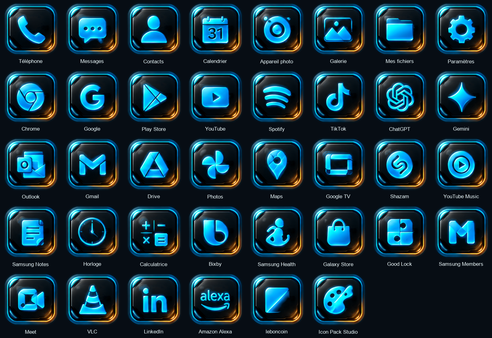

# Livraison HELIX-ICONS01 — 38 icônes

Date : 25 septembre 2026. Projet existant conservé, version Android 0.2.0-icons01 (code 2).

## Résultat

- **BUILD SUCCESSFUL**, commande réellement exécutée depuis `packages/icon-pack` :
  `.\gradlew.bat assembleDebug lintDebug --no-daemon --console=plain --offline`.
- 45 tâches : 20 exécutées, 25 à jour ; compilation finale en 31 secondes.
- Lint : **0 erreur, 41 avertissements** examinés : 39 ressources découvertes par nom (catalogue et PNG) considérées inutilisées par Lint, 1 recherche de ressource par nom nécessaire au diagnostic, 1 règle de sauvegarde Android 12 héritée du pilote. Aucun avertissement masqué ; aucun accès réseau ni permission Android.
- Vérification Gradle : 38 PNG RGBA 512 × 512, 76 mappings justifiés, XML et catalogue cohérents.
- `apksigner verify --verbose --print-certs` : signature v2 valide, même certificat debug que le pilote.
- Inspection du ZIP APK : exactement 38 PNG ; chaque image décodée est identique pixel pour pixel au PNG préparé. Appfilter : 76 entrées, catalogue : 38 entrées. Export et sortie Gradle identiques.
- Contrôle d’image : 38 PNG distincts, cadre extérieur identique, coins transparents, zone de sécurité respectée, empreinte de la grille intacte.
- **S24 physique / Theme Park : non testés.** La détection, l’association effective des versions installées et la stabilité de One UI Home restent à valider.

## APK

- Dépôt : `packages/HELIX-Icon-Pack-ICONS01-38.apk`.
- Sortie Gradle conservée : `packages/icon-pack/app/build/outputs/apk/debug/app-debug.apk`.
- Taille : 7,911,536 octets.
- SHA-256 : `b5cf6a64a02e8c56a4a786fcf784ddf44d689bf635bbd6c505c50d2ce30e9e98`.
- Pilote `packages/HELIX-Icon-Pack-PILOT.apk` conservé à l’identique : `d7299fd7f282bd64155e2b911975c2454e7cfb8e4ff2c646afd5bd457b55c09e`.

## Contrôle optique

Deux passes de comparaison côte à côte effectuées sur les planches complètes. Extraction depuis les pixels de la grille validée, sans génération d’images. Cadre commun extrait de Téléphone, intérieur nettoyé à partir des pixels sombres des cases. Chaque pictogramme est découpé indépendamment, redimensionné proportionnellement selon sa géométrie et positionné séparément ; les paramètres exacts sont dans `artwork-layout.json`.

Après la première passe : découpe supérieure Photos élargie ; poids optique de Maps, YouTube et Google TV augmenté ; Maps relevé de 2 pixels sur la toile 512. Play Store et TikTok possèdent un décalage horizontal propre ; Messages et Mes fichiers un décalage vertical. Les pictogrammes fins bénéficient d’une emprise plus large. La seconde planche a été examinée : pas de pictogramme visiblement perdu, déformé, coupé ou disproportionné. Les PNG sont des agrandissements de la grille raster ; aucun détail haute définition n’a été inventé.

Studio création et Bus Traffic Fever! sont exclus des PNG Android, catalogues et mappings. Ils subsistent seulement dans la copie intacte de la grille de référence.

## Ressources livrées

| Application | Ressource | Composants |
| --- | --- | --- |
| Téléphone | `helix_phone.png` | 1 |
| Messages | `helix_messages.png` | 3 |
| Contacts | `helix_contacts.png` | 2 |
| Calendrier | `helix_calendar.png` | 2 |
| Appareil photo | `helix_camera.png` | 1 |
| Galerie | `helix_gallery.png` | 2 |
| Mes fichiers | `helix_files.png` | 3 |
| Paramètres | `helix_settings.png` | 1 |
| Chrome | `helix_chrome.png` | 2 |
| Google | `helix_google.png` | 2 |
| Play Store | `helix_play_store.png` | 2 |
| YouTube | `helix_youtube.png` | 2 |
| Spotify | `helix_spotify.png` | 2 |
| TikTok | `helix_tiktok.png` | 4 |
| ChatGPT | `helix_chatgpt.png` | 1 |
| Gemini | `helix_gemini.png` | 1 |
| Outlook | `helix_outlook.png` | 2 |
| Gmail | `helix_gmail.png` | 1 |
| Drive | `helix_drive.png` | 3 |
| Photos | `helix_photos.png` | 1 |
| Maps | `helix_maps.png` | 1 |
| Google TV | `helix_google_tv.png` | 3 |
| Shazam | `helix_shazam.png` | 2 |
| YouTube Music | `helix_youtube_music.png` | 1 |
| Samsung Notes | `helix_samsung_notes.png` | 1 |
| Horloge | `helix_clock.png` | 2 |
| Calculatrice | `helix_calculator.png` | 1 |
| Bixby | `helix_bixby.png` | 2 |
| Samsung Health | `helix_samsung_health.png` | 2 |
| Galaxy Store | `helix_galaxy_store.png` | 3 |
| Good Lock | `helix_good_lock.png` | 3 |
| Samsung Members | `helix_samsung_members.png` | 3 |
| Meet | `helix_meet.png` | 2 |
| VLC | `helix_vlc.png` | 2 |
| LinkedIn | `helix_linkedin.png` | 3 |
| Amazon Alexa | `helix_alexa.png` | 2 |
| leboncoin | `helix_leboncoin.png` | 4 |
| Icon Pack Studio | `helix_icon_pack_studio.png` | 1 |

## Mappings

71 correspondances ajoutées ; 1 ancien candidat non corroboré retiré de l’appfilter actif. Les cinq correspondances corroborées du pilote sont conservées.

Source de recoupement : [Arcticons](https://github.com/Arcticons-Team/Arcticons/blob/main/app/src/main/res/xml/appfilter.xml), date et empreinte enregistrées dans `packages/icon-pack/mapping-evidence.json`.

À confirmer sur le téléphone : les alias réellement installés, notamment Samsung, LinkedIn, Google TV et leboncoin. Le candidat initial Messages `com.samsung.android.messaging.ui.view.main.WithActivity` est explicitement mis à l’écart en attente d’observation sur le S24. Aucun composant non corroboré n’a été inventé ou activé. Calendrier reste une icône statique 31, conforme au dessin.

| Application | Composant ajouté |
| --- | --- |
| Messages | `com.samsung.android.messaging/com.samsung.android.messaging.ui.ConversationListActivity` |
| Messages | `com.samsung.android.messaging/com.samsung.android.messaging.ui.ConversationList` |
| Contacts | `com.samsung.android.contacts/com.android.contacts.activities.PeopleActivity` |
| Contacts | `com.samsung.android.contacts/com.samsung.android.contacts.contactslist.PeopleActivity` |
| Calendrier | `com.samsung.android.calendar/com.android.calendar.AllInOneActivity` |
| Calendrier | `com.samsung.android.calendar/com.samsung.android.app.calendar.activity.MainActivity` |
| Galerie | `com.sec.android.gallery3d/com.sec.android.gallery3d.app.GalleryOpaqueActivity` |
| Galerie | `com.sec.android.gallery3d/com.samsung.android.gallery.app.activity.GalleryActivity` |
| Mes fichiers | `com.sec.android.app.myfiles/com.sec.android.app.myfiles.external.ui.MainActivity` |
| Mes fichiers | `com.sec.android.app.myfiles/com.sec.android.app.myfiles.external.ui.LaunchActivity` |
| Mes fichiers | `com.sec.android.app.myfiles/com.sec.android.app.myfiles.common.MainActivity` |
| Paramètres | `com.android.settings/com.android.settings.Settings` |
| Chrome | `com.android.chrome/com.android.chrome.Main` |
| Google | `com.google.android.googlequicksearchbox/com.google.android.googlequicksearchbox.SearchActivity` |
| Google | `com.google.android.googlequicksearchbox/com.google.android.googlequicksearchbox.GoogleSearch` |
| Play Store | `com.android.vending/com.android.vending.AssetBrowserActivity` |
| Play Store | `com.android.vending/com.google.android.finsky.activities.PlayLauncherActivity` |
| YouTube | `com.google.android.youtube/com.google.android.youtube.app.honeycomb.Shell$HomeActivity` |
| YouTube | `com.google.android.youtube/com.google.android.youtube.app.honeycomb.Shell` |
| Spotify | `com.spotify.music/com.spotify.music.MainActivity` |
| Spotify | `com.spotify.music/com.spotify.music.main.MainScreenActivity` |
| TikTok | `com.zhiliaoapp.musically/com.zhiliaoapp.musically.MainActivity` |
| TikTok | `com.zhiliaoapp.musically/com.ss.android.ugc.aweme.splash.SplashActivity` |
| TikTok | `com.zhiliaoapp.musically/com.ss.android.ugc.trill.splash.I18nSplashActivity` |
| TikTok | `com.zhiliaoapp.musically/com.zhiliaoapp.musically.activity.SplashActivity` |
| ChatGPT | `com.openai.chatgpt/com.openai.chatgpt.MainActivity` |
| Gemini | `com.google.android.apps.bard/com.google.android.apps.bard.shellapp.BardEntryPointActivity` |
| Outlook | `com.microsoft.office.outlook/com.microsoft.office.outlook.MainActivity` |
| Outlook | `com.microsoft.office.outlook/com.microsoft.office.outlook.ui.miit.MiitLauncherActivity` |
| Drive | `com.google.android.apps.docs/com.google.android.apps.docs.app.NewMainProxyActivity` |
| Drive | `com.google.android.apps.docs/com.google.android.apps.docs.app.HomeScreenActivity` |
| Drive | `com.google.android.apps.docs/com.google.android.apps.docs.app.MainProxyActivity` |
| Photos | `com.google.android.apps.photos/com.google.android.apps.photos.home.HomeActivity` |
| Maps | `com.google.android.apps.maps/com.google.android.maps.MapsActivity` |
| Google TV | `com.google.android.videos/com.google.android.videos.activity.HomeActivity` |
| Google TV | `com.google.android.videos/com.google.android.videos.activity.LauncherActivity` |
| Google TV | `com.google.android.videos/com.google.android.youtube.videos.EntryPoint` |
| Shazam | `com.shazam.android/com.shazam.android.activities.SplashActivity` |
| Shazam | `com.shazam.android/com.shazam.android.activities.MainActivity` |
| YouTube Music | `com.google.android.apps.youtube.music/com.google.android.apps.youtube.music.activities.MusicActivity` |
| Samsung Notes | `com.samsung.android.app.notes/com.samsung.android.app.notes.memolist.MemoListActivity` |
| Horloge | `com.sec.android.app.clockpackage/com.sec.android.app.clockpackage.ClockPackage` |
| Horloge | `com.sec.android.app.clockpackage/com.sec.android.app.clockpackage.common.activity.ClockPackage` |
| Calculatrice | `com.sec.android.app.popupcalculator/com.sec.android.app.popupcalculator.Calculator` |
| Bixby | `com.samsung.android.bixby.agent/com.samsung.android.bixby.assistanthome.AssistantHomeLauncherActivity` |
| Bixby | `com.samsung.android.bixby.agent/com.samsung.android.bixby.assistanthome.AssistantHomeMainActivity` |
| Samsung Health | `com.sec.android.app.shealth/com.samsung.android.app.shealth.home.HomeMainActivity` |
| Samsung Health | `com.sec.android.app.shealth/com.samsung.android.app.shealth.home.HomeDashboardActivity` |
| Galaxy Store | `com.sec.android.app.samsungapps/com.sec.android.app.samsungapps.SamsungAppsMainActivity` |
| Galaxy Store | `com.sec.android.app.samsungapps/com.sec.android.app.samsungapps.Main` |
| Galaxy Store | `com.sec.android.app.samsungapps/com.sec.android.app.samsungapps.SKSamsungMainActivity` |
| Good Lock | `com.samsung.android.goodlock/com.samsung.android.goodlock.MainActivity` |
| Good Lock | `com.samsung.android.goodlock/com.samsung.android.goodlock.presentation.view.LaunchActivity` |
| Good Lock | `com.samsung.android.goodlock/com.samsung.android.goodlock.presentation.view.PluginListActivity` |
| Samsung Members | `com.samsung.android.voc/com.samsung.android.voc.app.LauncherActivity` |
| Samsung Members | `com.samsung.android.voc/com.samsung.android.voc.MainActivity` |
| Samsung Members | `com.samsung.android.voc/com.samsung.android.voc.LauncherActivity` |
| Meet | `com.google.android.apps.tachyon/com.google.android.apps.tachyon.MainActivitySecondLauncher` |
| Meet | `com.google.android.apps.tachyon/com.google.android.apps.tachyon.MainActivity` |
| VLC | `org.videolan.vlc/org.videolan.vlc.StartActivity` |
| VLC | `org.videolan.vlc/org.videolan.vlc.gui.MainActivity` |
| LinkedIn | `com.linkedin.android/com.linkedin.android.authenticator.LaunchActivity` |
| LinkedIn | `com.linkedin.android/com.linkedin.android.authenticator.LaunchActivityDefault` |
| LinkedIn | `com.linkedin.android/com.linkedin.android.MainActivity` |
| Amazon Alexa | `com.amazon.dee.app/com.amazon.dee.app.Launcher` |
| Amazon Alexa | `com.amazon.dee.app/com.amazon.dee.webapp.activity.AlexaWebAppActivity` |
| leboncoin | `fr.leboncoin/fr.leboncoin.feature.splashscreen.ui.activities.SplashScreenActivity` |
| leboncoin | `fr.leboncoin/fr.leboncoin.ui.activities.SplashScreenActivity` |
| leboncoin | `fr.leboncoin/fr.leboncoin.splashscreen.ui.activities.SplashScreenActivity` |
| leboncoin | `fr.leboncoin/fr.leboncoin.features.splashscreen.ui.activities.SplashScreenActivity` |
| Icon Pack Studio | `ginlemon.iconpackstudio/ginlemon.iconpackstudio.editor.homeActivity.HomeActivity` |

## Fichiers modifiés

- `docs/ICON-PACK.md`
- `packages/icon-pack/README.md`
- `packages/icon-pack/app-map.csv`
- `packages/icon-pack/app/build.gradle`
- `packages/icon-pack/app/src/main/AndroidManifest.xml`
- `packages/icon-pack/app/src/main/assets/appfilter.xml`
- `packages/icon-pack/app/src/main/assets/drawable.xml`
- `packages/icon-pack/app/src/main/java/fr/carolab/helix/icons/MainActivity.java`
- `packages/icon-pack/app/src/main/res/values/drawables.xml`
- `packages/icon-pack/app/src/main/res/values/iconpack.xml`
- `packages/icon-pack/app/src/main/res/values/strings.xml`
- `packages/icon-pack/app/src/main/res/xml/appfilter.xml`
- `packages/icon-pack/app/src/main/res/xml/drawable.xml`
- `packages/icon-pack/build.gradle`

## Fichiers créés

- `icons/helix-icons01/BUILD-REPORT.md`
- `icons/helix-icons01/artwork-checks.json`
- `icons/helix-icons01/artwork-layout.json`
- `icons/helix-icons01/contact-sheet.png`
- `icons/helix-icons01/frame-master.png`
- `icons/helix-icons01/reference-grid.png`
- `icons/helix-icons01/review-preview.png`
- `packages/HELIX-Icon-Pack-ICONS01-38.apk`
- `packages/icon-pack/app/src/main/res/drawable-nodpi/helix_alexa.png`
- `packages/icon-pack/app/src/main/res/drawable-nodpi/helix_bixby.png`
- `packages/icon-pack/app/src/main/res/drawable-nodpi/helix_calculator.png`
- `packages/icon-pack/app/src/main/res/drawable-nodpi/helix_calendar.png`
- `packages/icon-pack/app/src/main/res/drawable-nodpi/helix_camera.png`
- `packages/icon-pack/app/src/main/res/drawable-nodpi/helix_chatgpt.png`
- `packages/icon-pack/app/src/main/res/drawable-nodpi/helix_chrome.png`
- `packages/icon-pack/app/src/main/res/drawable-nodpi/helix_clock.png`
- `packages/icon-pack/app/src/main/res/drawable-nodpi/helix_contacts.png`
- `packages/icon-pack/app/src/main/res/drawable-nodpi/helix_drive.png`
- `packages/icon-pack/app/src/main/res/drawable-nodpi/helix_files.png`
- `packages/icon-pack/app/src/main/res/drawable-nodpi/helix_galaxy_store.png`
- `packages/icon-pack/app/src/main/res/drawable-nodpi/helix_gallery.png`
- `packages/icon-pack/app/src/main/res/drawable-nodpi/helix_gemini.png`
- `packages/icon-pack/app/src/main/res/drawable-nodpi/helix_gmail.png`
- `packages/icon-pack/app/src/main/res/drawable-nodpi/helix_good_lock.png`
- `packages/icon-pack/app/src/main/res/drawable-nodpi/helix_google.png`
- `packages/icon-pack/app/src/main/res/drawable-nodpi/helix_google_tv.png`
- `packages/icon-pack/app/src/main/res/drawable-nodpi/helix_icon_pack_studio.png`
- `packages/icon-pack/app/src/main/res/drawable-nodpi/helix_leboncoin.png`
- `packages/icon-pack/app/src/main/res/drawable-nodpi/helix_linkedin.png`
- `packages/icon-pack/app/src/main/res/drawable-nodpi/helix_maps.png`
- `packages/icon-pack/app/src/main/res/drawable-nodpi/helix_meet.png`
- `packages/icon-pack/app/src/main/res/drawable-nodpi/helix_messages.png`
- `packages/icon-pack/app/src/main/res/drawable-nodpi/helix_outlook.png`
- `packages/icon-pack/app/src/main/res/drawable-nodpi/helix_phone.png`
- `packages/icon-pack/app/src/main/res/drawable-nodpi/helix_photos.png`
- `packages/icon-pack/app/src/main/res/drawable-nodpi/helix_play_store.png`
- `packages/icon-pack/app/src/main/res/drawable-nodpi/helix_samsung_health.png`
- `packages/icon-pack/app/src/main/res/drawable-nodpi/helix_samsung_members.png`
- `packages/icon-pack/app/src/main/res/drawable-nodpi/helix_samsung_notes.png`
- `packages/icon-pack/app/src/main/res/drawable-nodpi/helix_settings.png`
- `packages/icon-pack/app/src/main/res/drawable-nodpi/helix_shazam.png`
- `packages/icon-pack/app/src/main/res/drawable-nodpi/helix_spotify.png`
- `packages/icon-pack/app/src/main/res/drawable-nodpi/helix_tiktok.png`
- `packages/icon-pack/app/src/main/res/drawable-nodpi/helix_vlc.png`
- `packages/icon-pack/app/src/main/res/drawable-nodpi/helix_youtube.png`
- `packages/icon-pack/app/src/main/res/drawable-nodpi/helix_youtube_music.png`
- `packages/icon-pack/catalog.json`
- `packages/icon-pack/mapping-evidence.json`
- `packages/icon-pack/tools/prepare_artwork.py`
- `packages/icon-pack/tools/prepare_catalog.py`
- `packages/icon-pack/tools/requirements-artwork.txt`
- `packages/icon-pack/tools/sync_resources.py`
- `packages/icon-pack/tools/verify_artwork.py`

Aucune modification des wallpapers, widgets, folders, sources ou du README principal. Aucun fichier existant supprimé. Les caches, SDK et clés privées restent hors Git.
